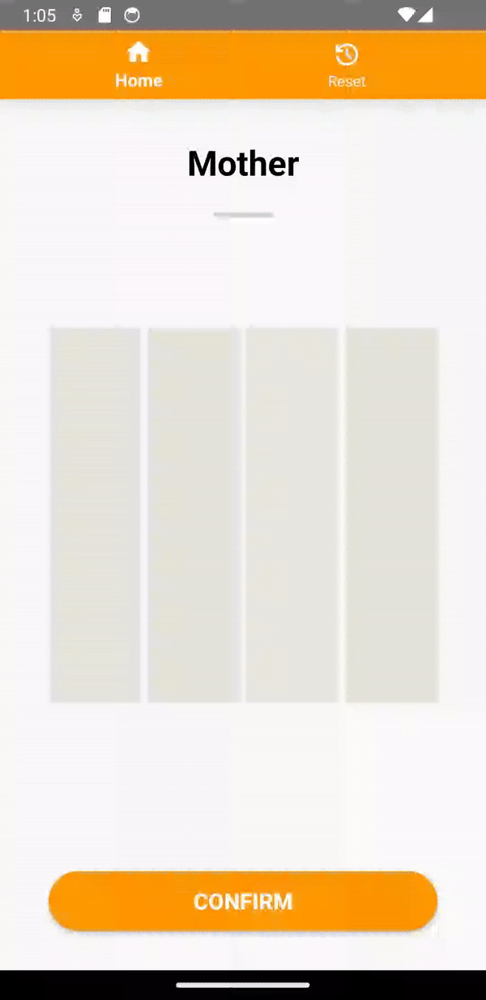
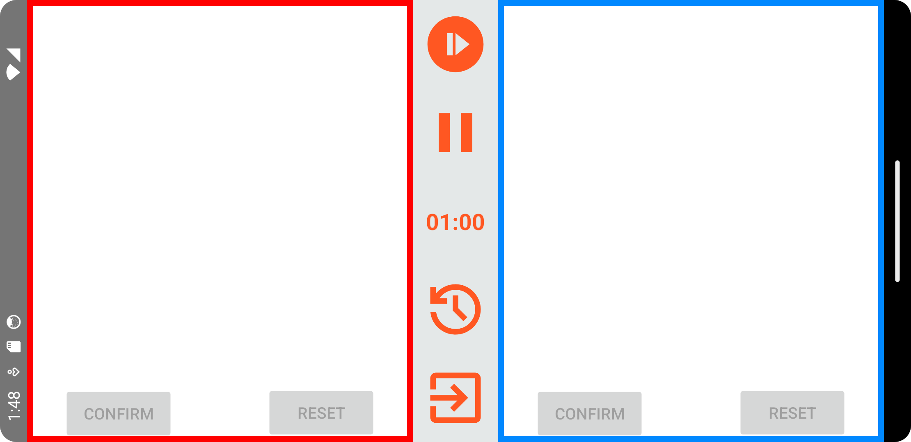
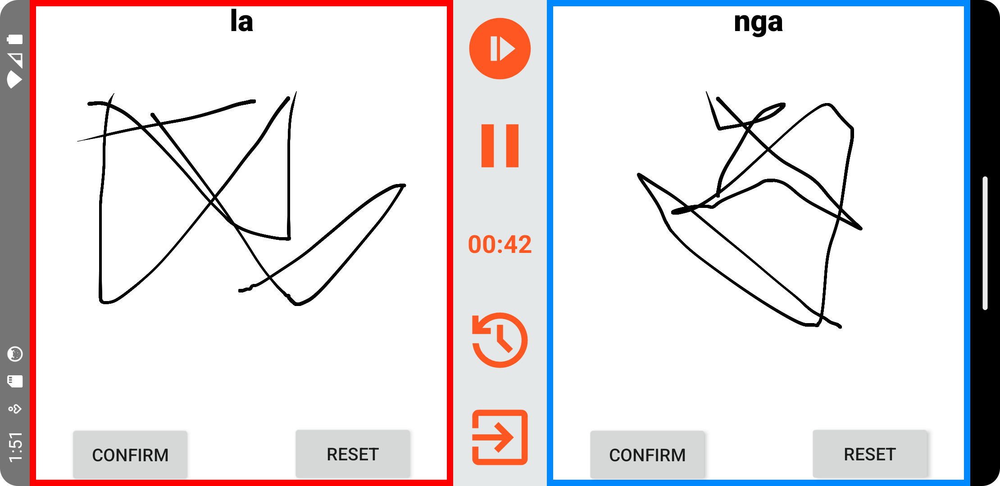

# TamilScribe - Final Year Project

### Problem Statement
As someone who was born and raised in England whilst being of Tamil origin, I have faced the challenge of trying to learn my mother tongue alongside my first language.       Life in Western countries where Tamil is not a core language with the added demands of daily life, education and work makes it difficult for second-generational Tamils to maintain proficiency in a language that is so rooted in their identity and heritage. This problem also extends to those who are not Tamil, but still want to learn the language.

The result has been the creation of Tamil e-learning applications, to help with the dilemma that Tamils and non-Tamils face when learning the language. The issue with current applications on the market is they include in-app purchases that withold functionality, placing another barrier in-front of learners. In addition, they also lack gamification techniques which have proven to increase engagement and the exercises only allow for tracing, limiting the ability for a user to learn.  

### Solution
TamilScribe is a Tamil e-learning Android application that makes use of Convolutional Neural Network (CNN) architecture to judge user drawings based on prompts. The app includes exercises for drawing Tamil vowels, consonants and words. In terms of gamification techniques, TamilScribe includes badges to be earned through exercises, leaderboards to track progress overtime and an 1vs1 gamemode to compete against a peer locally to write as many Tamil characters before time runs out.   

### Menu Screens - Title, Home, Exercises, Achievements 
    

### Exercises - Vowels, Consonants, Words, Freestyle
    

### Competitive 1vs1 Writing Activity
 
